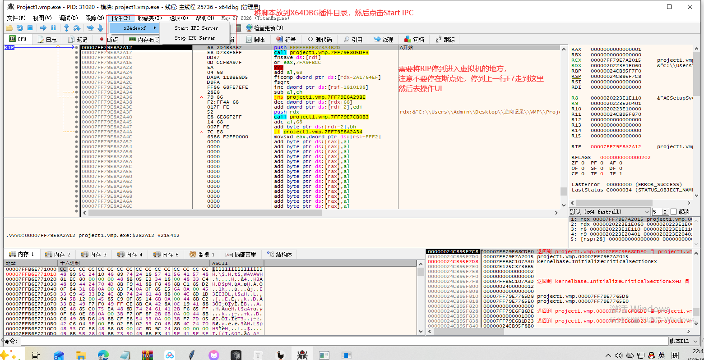
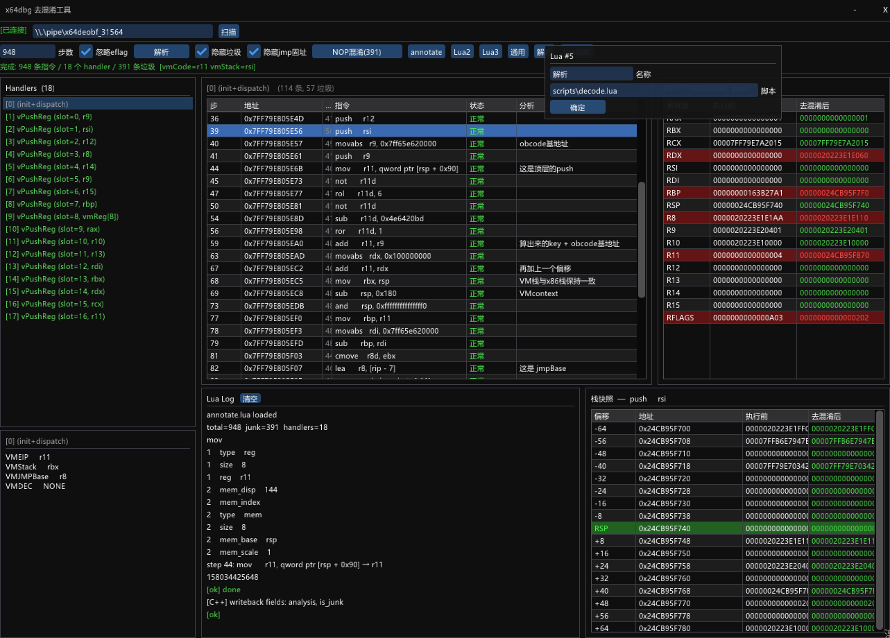

# DisassembleVmp — VMProtect 虚拟化分析引擎

一个面向 VMProtect 虚拟化代码的可编程分析引擎。如果你刚开始研究去虚拟化这个工具能帮助到你，他能去除混淆让你直观的看到虚拟化的核心代码，配合LUA脚本还原虚拟化保护背后的真实逻辑。但是目前作者菜的扣脚，还没有真正理解VMP的精髓，因此脚本需要阁下亲自编写了。

注意:本工具目前支持拆分HANDLE 但是对于HANDLE的解析可能完全是错的，需要修改C代码 或者通过LUA重写HANDLE识别。

## 设计理念

VMProtect 虚拟化的分析不能仅靠静态规则。每个被保护的程序都有不同的 handler 结构、寄存器映射和栈布局。DisassembleVmp 提供的是一个**分析基础设施**：

1. **自动化去混淆** — Unicorn 模拟执行 + Sleigh PCode 语义分析，自动识别并标记垃圾指令
2. **Handler 识别与分类** — 自动划分 VMP handler 边界，识别 vPushReg/vPopReg/vPushImm 等类型
3. **Lua 脚本引擎** — 将指令序列、寄存器快照、栈快照、PCode 语义、Capstone 结构化操作数全部导出到 Lua，由用户编写脚本完成针对性分析
4. **交互式右键分析** — 右键任意指令即可生成 Capstone 操作数匹配模板，直接粘贴到脚本中使用

去混淆是引擎的内置能力，但真正的分析工作由 Lua 脚本驱动。引擎负责把原始 trace 变成结构化的、可编程的数据，脚本负责提问和回答。

## 项目结构

```
DisassembleVmp/
├── engine/              分析引擎（vmp_engine.exe）
│   ├── src/
│   │   ├── vmp/         核心分析逻辑（模拟、PCode、死代码消除、分类、Lua 引擎）
│   │   ├── ui/          ImGui 界面
│   │   └── ipc/         与 x64dbg 插件通信
│   └── deps/imgui/      Dear ImGui 源码
├── plugin/              x64dbg 插件（x64deobf.dp64）
│   └── src/             IPC server + 内存读写 + 寄存器快照
├── libsla/              Ghidra Sleigh 翻译引擎（libsla.lib）
│   └── src/             Ghidra Decompiler C++ 源码
├── deps/                预编译第三方依赖
│   ├── capstone/        反汇编引擎
│   ├── unicorn/         CPU 模拟引擎
│   ├── lua/             Lua 5.4 脚本引擎
│   ├── zlib/            压缩库
│   └── pluginsdk/       x64dbg 插件 SDK
├── specfiles/           Sleigh .sla 规范文件（运行时需要）
├── scripts/             Lua 分析脚本
└── DisassembleVmp.sln   Visual Studio 解决方案
```

## 工作流程

```
x64dbg 调试目标程序
    │
    ▼
x64deobf 插件（named pipe IPC）
    │  提供：读内存、读寄存器、NOP 写入
    ▼
vmp_engine 分析引擎
    ├── Unicorn 模拟执行 → 指令序列 + 寄存器/栈快照
    ├── Capstone 反汇编 → 结构化操作数（type/reg/mem/imm）
    ├── Sleigh PCode 翻译 → 语义原子操作
    ├── 死代码消除 → 标记垃圾指令
    ├── Handler 分类 → 识别 VMP handler 类型
    └── Lua 脚本引擎 → 用户自定义分析逻辑
```

## Lua 脚本能力

引擎将完整的分析结果导出到 Lua 环境，脚本可以访问：

| 数据 | 说明 |
|------|------|
| `rows[]` | 每条指令的地址、汇编、字节、是否垃圾、分析标注 |
| `rows[].mnemonic / .operands[]` | Capstone 结构化操作数（type/reg/mem_base/mem_disp/imm） |
| `rows[].regs / .stack` | Unicorn 运行时寄存器和栈快照 |
| `rows[].pcode[]` | Sleigh PCode 语义操作（opc_name/out/ins/dead） |
| `handlers[]` | Handler 划分、类型、地址范围、STORE/LOAD 计数 |
| `read_mem() / read_u64()` | 实时读取调试目标内存 |
| `set_clipboard()` | 将文本写入系统剪贴板 |
| `context_row` | 右键菜单触发时的当前行索引 |

## 使用方式

x64deobf.dp64放到X64dbg插件目录然后运行x64DBG



运行vmp_engine.exe 点击解析




## 构建

**环境要求：** Visual Studio 2019+ (MSVC v142)，Windows SDK 10.0+

所有依赖已包含在仓库中，克隆即可编译：

```bash
git clone https://github.com/yourname/DisassembleVmp.git
cd DisassembleVmp
msbuild DisassembleVmp.sln /p:Configuration=Release /p:Platform=x64 /m
```

**构建顺序：** libsla -> vmp_engine / x64deobf（sln 中已配置依赖关系）

**产物：**

| 项目 | 输出 | 说明 |
|------|------|------|
| libsla | `libsla\bin\Release\libsla.lib` | Sleigh 翻译引擎静态库 |
| vmp_engine | `engine\bin\Release\vmp_engine.exe` | 分析引擎主程序 |
| x64deobf | `plugin\bin\Release\x64deobf.dp64` | x64dbg 插件 |

## 许可证

本项目以 **GPL-3.0** 许可证发布。详见 [LICENSE](LICENSE) 文件。

选择 GPL-3.0 是因为本项目链接了 x64dbg SDK (GPL-3.0) 和 Unicorn Engine (GPL-2.0)，GPL-3.0 是满足所有依赖许可证要求的最宽松选择。

## 第三方依赖

| 依赖 | 版本 | 许可证 | 用途 |
|------|------|--------|------|
| [x64dbg](https://github.com/x64dbg/x64dbg) | — | GPL-3.0 | 调试器平台，插件 SDK |
| [Unicorn Engine](https://github.com/unicorn-engine/unicorn) | 2.x | GPL-2.0 | CPU 模拟执行引擎 |
| [Ghidra](https://github.com/NationalSecurityAgency/ghidra) (Sleigh) | 12.1.2 | Apache-2.0 | PCode 语义翻译引擎 |
| [Capstone](https://github.com/capstone-engine/capstone) | 5.x | BSD-3-Clause | x86-64 反汇编与结构化操作数 |
| [Dear ImGui](https://github.com/ocornut/imgui) | 1.91+ | MIT | UI 渲染框架 (DirectX 11) |
| [Lua](https://www.lua.org/) | 5.4 | MIT | 内嵌脚本引擎 |
| [nlohmann/json](https://github.com/nlohmann/json) | 3.x | MIT | JSON 解析 (IPC 协议) |
| [zlib](https://github.com/madler/zlib) | — | zlib | 数据压缩 (.sla 文件解析) |

### 许可证兼容性

- **GPL-3.0** (x64dbg) — 本项目整体遵循 GPL-3.0
- **GPL-2.0** (Unicorn) — 以动态链接方式集成 (unicorn.dll)
- **Apache-2.0** (Ghidra Sleigh) — 与 GPL-3.0 兼容
- **BSD-3-Clause / MIT / zlib** — 宽松许可证，均与 GPL-3.0 兼容

### 第三方文件分布

```
deps/pluginsdk/          x64dbg 插件 SDK (GPL-3.0)
deps/capstone/           Capstone 头文件 + .lib (BSD-3-Clause)
deps/unicorn/            Unicorn 头文件 + .lib/.dll (GPL-2.0)
deps/lua/                Lua 头文件 + .lib (MIT)
deps/zlib/               zlib 头文件 + .lib (zlib)
libsla/src/              Ghidra Sleigh C++ 源码 (Apache-2.0)
engine/deps/imgui/       Dear ImGui 源码 (MIT)
plugin/deps/nlohmann/    nlohmann/json 头文件 (MIT)
```

## 免责声明

本工具仅供安全研究与逆向工程学习使用。使用者应确保其行为符合所在地区的法律法规。作者不对任何滥用行为承担责任。
